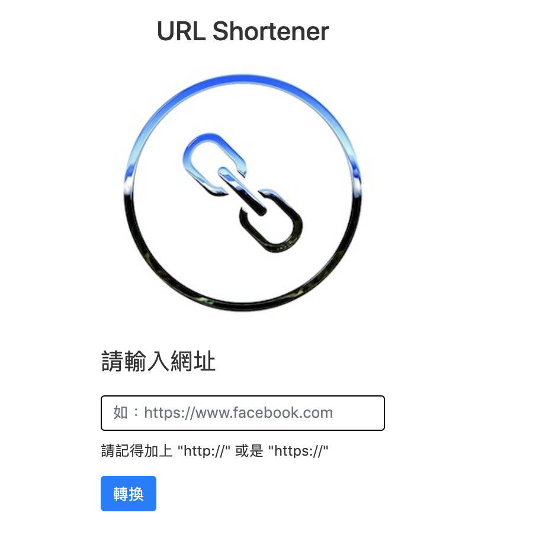

# URL Shortener
# 短網址生成器
運用 Node.js, mongoDB 製作的前後端應用程式，使用者可以隨機生成一組短網址。

## 環境建置與需求
* [Node.js version 10.16.0 (LTS)](https://nodejs.org/en/)
* [以及一連串的套件清單，請閱讀 package.json](https://tinyurl.com/y5dogmw9)

## 網站版本試用
* [點選此處前往](https://tinyurl.com/y5w8y7dn)
## How to use? 如何使用？
1. 利用 git 或是 cmd 在目標資料夾下輸入以下指令
```
git clone https://github.com/andy922200/URL_shortener.git
```
2. 打開終端機，切換到存放的資料夾 
3. 接著，安裝相關的套件
```
npm install 
```
4. 輸入以下指令
```
npm run dev
```
5. 連線到 MongoDB (透過終端機指令連線，且預設為安裝在根目錄下, port number: 27017)
```
cd ~/mongodb/bin/ 
./mongod --dbpath /Users/[your username]/mongodb-data --bind_ip 127.0.0.1
```
6. 運用 Robo3T 等工具，新增 record 資料庫 
7. 載入種子資料
```
npm run seeder 
```
8. 打開瀏覽器，輸入 localhost:3000 即可使用

## 螢幕截圖
